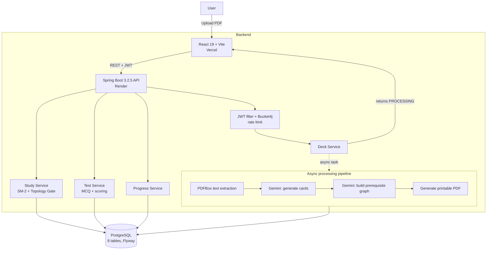

# FluxCards — AI Flashcard Engine

> Upload a PDF and FluxCards turns it into a structured deck of flashcards, builds a prerequisite knowledge graph between the concepts, and schedules your reviews with spaced repetition — surfacing each card only once you've mastered what it depends on.

<p align="left">
  
  
  
  
  
</p>

**Live demo:** [fluxcards-flashcard-engine.vercel.app](https://fluxcards-flashcard-engine.vercel.app/)

<!-- TODO: Add a screenshot or short GIF here — ideally showing a PDF upload turning into a deck, plus the study view. This is the single highest-impact addition to the repo.

-->

---

## What it does

Making flashcards by hand is slow, and studying them in a random order means you often hit advanced material before the basics are solid. FluxCards solves both:

1. **Generate** — upload a PDF; the backend extracts the text and uses an LLM to produce flashcards tagged with a concept name, category, and difficulty.
2. **Connect** — a second AI pass identifies prerequisite relationships between the concepts and stores them as a directed graph.
3. **Schedule** — an SM-2 spaced-repetition scheduler decides when each card is due, and a *Topology Gate* withholds a card until every prerequisite is mastered.

The engineering focus is the backend: an asynchronous processing pipeline, a resilient AI integration, a secured REST API, and a normalized relational model of decks, cards, dependencies, and review history.

## Key features

- **Asynchronous PDF processing** — uploads return immediately with a `PROCESSING` status; a thread-pool executor extracts text, calls the AI, and flips the deck to `READY` (or `FAILED`) in the background, so the request never blocks on the AI call.
- **Resilient AI generation** — the Gemini integration walks a fallback chain of models (`gemini-2.5-flash-lite` → `gemini-flash-lite-latest` → `gemini-2.5-flash`), so a single model outage doesn't break generation. Responses are defensively parsed to tolerate markdown fences and varying JSON shapes.
- **AI-built knowledge graph** — concepts are linked by high-confidence prerequisite relationships; dependency extraction is non-fatal, so a deck still succeeds if the graph step fails.
- **SM-2 spaced repetition** — per-user, per-card review state (easiness factor, interval, repetitions, next-review date).
- **Topology Gate** — a card enters the study queue only when all of its prerequisites are mastered (`repetitions ≥ 2` and `easiness factor ≥ 2.0`) and it is due.
- **MCQ test mode** — generate a multiple-choice test from a deck, submit answers, and get category-level scoring plus test history.
- **Progress & mastery tracking** — per-deck and overall mastery summaries.
- **Downloadable flashcard PDF** — once a deck is ready, a printable PDF of its cards is generated and stored for download.
- **JWT auth with refresh-token rotation** — stateless access tokens plus persisted refresh tokens.
- **Upload rate limiting** — Bucket4j caps PDF uploads at 5 per user per hour.
- **Versioned schema** — 12 Flyway migrations; JPA runs in `validate` mode so the schema is owned by migrations, not Hibernate.

## Architecture



## How the two differentiators work

### SM-2 spaced repetition

After each review you rate recall quality from 0 (blackout) to 5 (perfect):

- **Quality < 3** — the card resets: repetitions → 0, interval → 1 day.
- **Quality ≥ 3** — the easiness factor updates as `EF + 0.1 − (5−q)·(0.08 + (5−q)·0.02)`, floored at 1.3. The interval grows 1 day → 6 days → `round(interval × EF)` thereafter.
- `next_review_at = today + interval`.

Cards you know well drift further apart; cards you struggle with come back quickly.

### Topology Gate

Most flashcard apps let you study in any order. FluxCards enforces prerequisite mastery first:

1. During generation, the AI marks prerequisite links between concepts (e.g. *Limits* before *Derivative Rules*), stored in `card_dependencies` as a directed graph.
2. When building the study queue, each card's prerequisites are checked. A prerequisite is "mastered" at `repetitions ≥ 2` and `easiness_factor ≥ 2.0`.
3. If any prerequisite is unmastered, the card is held back. Only cards whose prerequisites are all mastered (or that have none) and that are due appear in the queue.

The result: you're walked through the knowledge graph in dependency order, so every new concept rests on a solid base.

## Tech stack

| Layer | Technology |
|---|---|
| Language | Java 21 |
| Framework | Spring Boot 3.2.5, Spring Security 6, Spring Data JPA, Bean Validation |
| AI / parsing | Gemini API (model fallback chain), Apache PDFBox 2.0.30 |
| Persistence | PostgreSQL, Hibernate ORM, HikariCP |
| Migrations | Flyway 10 |
| Auth & limits | JWT (jjwt 0.12.5) with refresh rotation, Bucket4j 8.10.1 |
| Async | Spring `@Async` with a tuned `ThreadPoolTaskExecutor` |
| Ops | Spring Boot Actuator (health), SLF4J logging |
| Frontend | React 19, Vite, Zustand, Axios, React Router 7 |
| Deployment | Backend on Render (Docker) · Frontend on Vercel |
| Build | Maven, Lombok |

## API reference

All endpoints except `/api/auth/**` require a `Bearer` access token.

| Method | Endpoint | Description |
|---|---|---|
| `POST` | `/api/auth/register` | Create an account |
| `POST` | `/api/auth/login` | Authenticate; returns access + refresh tokens |
| `POST` | `/api/auth/refresh` | Rotate refresh token; issue a new access token |
| `GET` | `/api/decks` | List the user's decks |
| `POST` | `/api/decks` | Upload a PDF (multipart) to create a deck |
| `GET` | `/api/decks/{id}` | Get a deck and its status |
| `DELETE` | `/api/decks/{id}` | Delete a deck |
| `GET` | `/api/decks/{id}/pdf` | Download the generated flashcard PDF |
| `GET` | `/api/decks/{id}/cards` | List a deck's cards |
| `GET` | `/api/decks/{id}/graph` | Get the deck's prerequisite dependency graph |
| `GET` | `/api/study/queue` | Get the due study queue (SM-2 + Topology Gate) |
| `POST` | `/api/study/review` | Submit a card review (quality 0–5) |
| `GET` | `/api/decks/{id}/test` | Generate an MCQ test for a deck |
| `POST` | `/api/decks/{id}/test/submit` | Submit test answers; returns scored results |
| `GET` | `/api/test/history` | List past test sessions |
| `GET` | `/api/progress/summary` | Overall mastery summary |
| `GET` | `/api/progress/deck/{id}` | Per-deck mastery breakdown |

## Data model

Eight normalized tables, managed by Flyway:

`users` · `refresh_tokens` · `decks` · `cards` · `card_dependencies` (the knowledge graph) · `card_reviews` (SM-2 state) · `misconception_logs` · `test_sessions`

Decks move through a status lifecycle: `PROCESSING → READY` (or `FAILED`).

## Getting started

### Prerequisites

- Java 21
- Maven 3.9+
- PostgreSQL 15+
- A Gemini API key

### Run locally

```bash
git clone https://github.com/sanchitpdev/flashcard-engine.git
cd flashcard-engine

# set the environment variables below, then:
./mvnw spring-boot:run
```

The backend starts on `http://localhost:8080`. Flyway applies all migrations on startup against a clean database.

### Environment variables

| Variable | Required | Default | Description |
|---|---|---|---|
| `DATABASE_URL` | yes | — | JDBC URL, e.g. `jdbc:postgresql://localhost:5432/fluxcards` |
| `DATABASE_USERNAME` | yes | — | Database user |
| `DATABASE_PASSWORD` | yes | — | Database password |
| `GEMINI_API_KEY` | yes | — | Google Gemini API key |
| `JWT_SECRET` | yes | — | Secret for signing JWTs |
| `JWT_ACCESS_EXPIRY_MS` | no | `900000` | Access-token lifetime (15 min) |
| `JWT_REFRESH_EXPIRY_MS` | no | `604800000` | Refresh-token lifetime (7 days) |
| `CORS_ALLOWED_ORIGINS` | no | `http://localhost:5173` | Allowed frontend origin(s) |
| `GEMINI_MODEL` | no | `gemini-2.5-flash` | Default model hint |
| `PORT` | no | `8080` | Server port |
| `LOG_LEVEL` | no | `INFO` | App log level |

### Frontend

```bash
cd frontend
npm install
npm run dev          # Vite dev server on http://localhost:5173
```

<!-- TODO: Confirm the env var the frontend uses for the API base URL (e.g. VITE_API_URL) and document it here. -->

### Docker

A multi-stage `Dockerfile` (build on `maven:3.9.6-eclipse-temurin-21`, run on a slim JRE as a non-root user) and a `docker-compose.yml` are included:

```bash
docker compose up --build
```

## Deployment

- **Backend** — containerized and deployed on Render via `render.yaml`; the image runs as a non-root user with container-aware JVM memory flags.
- **Frontend** — deployed on Vercel (`frontend/vercel.json`).

## License

<!-- TODO: Add a LICENSE file. MIT is the common permissive default for portfolio projects. -->
Released under the MIT License.

## Contact

**Sanchit Pawar** — [LinkedIn](https://linkedin.com/in/sanchitpawar) · [GitHub](https://github.com/sanchitpdev) · sanchitp.dev@gmail.com
